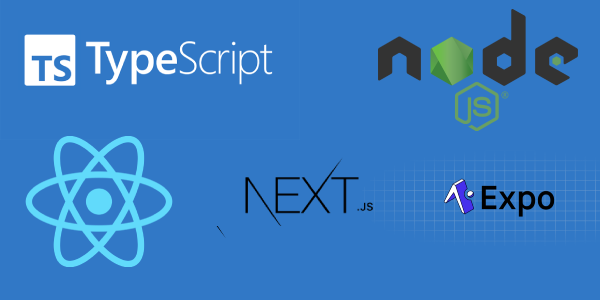

# Typerepo

Welcome to **Typerepo**. Typerepo was developed by [Code From Anywhere](https://codefromanywhere.com) to build out all their full stack platforms with. We made it public because we believe in the power of community and want you to build something amazing with it.

Are you a software developer working on an MVP? Do you not want to reinvent the wheel for all common capabilities of your platform like auth, monetisation, and front-backend integration? Then **Typerepo** is for you.

**What is typerepo?** Typerepo aims to make it as easy as possible to build high-quality full-stack mobile- and web-apps. Think of Typerepo as a [ruby on rails](https://rubyonrails.org/) on steroids, full stack, for typescript...

Typerepo is a collection of tools, conventions and a large SDK that brings together the well-known **Typescript** frameworks: **Node.js**, **Expo.dev** and **Next.js** under 1 bigger whole.



# Getting started

```bash
git clone https://github.com/CodeFromAnywhere/typerepo.git
cd typerepo
yarn
yarn dev
```

This will start up the typerepo server + dev admin, from where you can further launch all tools.

Make sure you have `node` 17+ (we are using the new fetch api)

Read our [docs](docs) to find our API reference, guides, tutorials, and examples!

# Community

Join our community where dozens of developers are building the tech of tomorrow. [**Join us now on Slack**](https://join.slack.com/t/codefromanywhere/shared_invite/zt-1kstsx8dc-BsfwKJtEYAxh_N1BxSnoRg)


# Features

✅ **Automatic form generation** Generate forms from your functions without writing any frontend code


[](./mov2.placeholder.jpeg)
✅ **API generation** You don't need to write endpoints, just write your functions in the node environment and they will be accessible as CLI as well as through the API

✅ **API type-safety** Your backend functions are directly accessible via the `api` object on the frontend. We also support `react-query` by creating a fully-typed `useQuery` for you for every backend-function, automatically.


✅ **Automatic documentation** Everything you code automatically becomes part of your docs, no need to write them separately!


✅ **Asset upload** You don't need to integrate to any third party services to allow asset upload, and there is no set up required! You can allow image upload at any page with a single line of code.


✅ **Database** we created `typebase` to bring first-class support for anything we're still going to build.


✅ **Admin panels** We bring all your code together in an admin panel where you can try out your functions and control all your data in the database.


# What's to come

🟠 **Web3 first** from the ground up, typerepo was built to support decentralised systems and peer to peer as a first-class citizen


🟠 **Test automation** We are building a different, better way to test your code

🟠 **Execution monitoring** Soon, you can see all the functions executed in your backend and monitor different things

🟠 **Monetisation** We're building an SDK to help you monetise your platform out of the box. We're planning on integrating with Stripe and Crypto!

🟠 **Authentication + Authorisation** We're building a general purpose auth layer that any app can use, out of the box!

🟠 **Code Marketplace** We're building the developers creator economy by enabling developers to earn money for their open source code more easily. No sponsorship, cold hard cash!


Many more things are coming!
