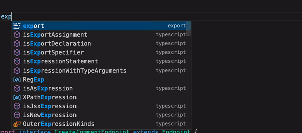
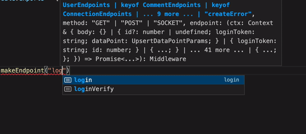
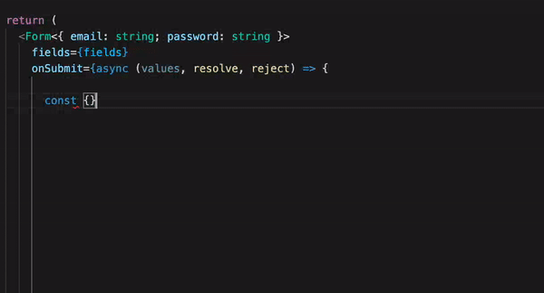
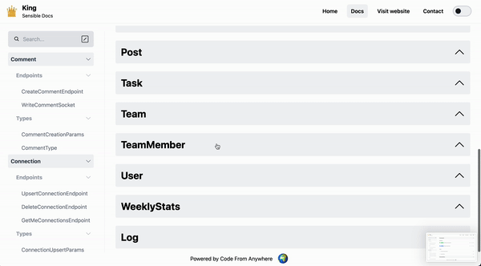

<p align="center">
<a href="https://www.typerepo.com" target="_blank">
<br />
website
</a> |
<a href="https://typerepo.com">docs</a>
</p>

# Welcome

TypeRepo is a full stack typescript framework that lets you build apps super quickly and smoothly. TypeRepo lets you easily share your code between `React` and `React Native`, and between `front-end` and `back-end`. It has never been this easy! TypeRepo's mission is to boost the productivity of 100.000+ Software Developers, making it as easy as possible to build high-quality full-stack mobile- and web-apps.

Want to know more? See the [docs](https://typerepostack.com)

## Installation instructions

1. Make sure you have `brew`, `node`, `npm` and `npx`. If you don't, this is how to install them:

```
/bin/bash -c "$(curl -fsSL https://raw.githubusercontent.com/Homebrew/install/HEAD/install.sh)"
```

```
brew install node
```

2. clone this repo

```
git clone https://github.com/CodeFromAnywhere/typerepo.git
```

3. run `yarn` and `npx dev` to get developing!

<p align="center">
  
</p>

## How does it work?

Define endpoints (and other type interfaces) in a central place



Write your endpoint with complete typesafety



Call your endpoint with complete type-safety and autocompletion (no boilerplate needed!)



If you need more help, just look in the auto-generated docs!



> Well... The above shows v1.. v2 is much better!

## The Core TypeRepo Philosophy

- Codebase introspection (Documentation generation)
- Full-stack code-sharing (full-stack auto-completion using Typescript)
- Maximise learnability, minimise tech debt, simplify onboarding
- Decentralised, Open Source, Automatic

## Demo

Check [our demo](https://demo.typerepo.com) here.

To run the app locally, do the following

- clone this repo
- follow the [expo installation instructions](https://docs.expo.dev/get-started/installation/) of expo (react-native)
- `yarn` in root folder
- `yarn dev` in root folder
- new terminal tab: `yarn start:server` in root folder
- new terminal tab: `yarn start:app` in root folder. Open your camera and **scan the QR code** or run the app using the simulator ([XCode required](https://docs.expo.dev/workflow/ios-simulator/))
- new terminal tab: `yarn start:web` in root folder (show it at http://localhost:3000)

<p align="center">
<a href="https://www.typerepo.com" target="_blank">
<br />
website
</a> |
<a href="https://typerepo.com">docs</a>
</p>
